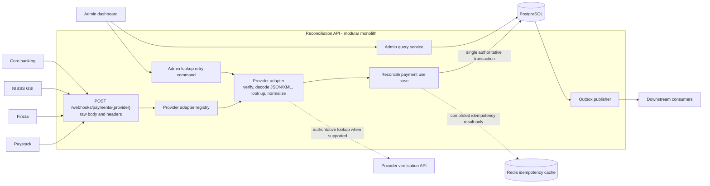
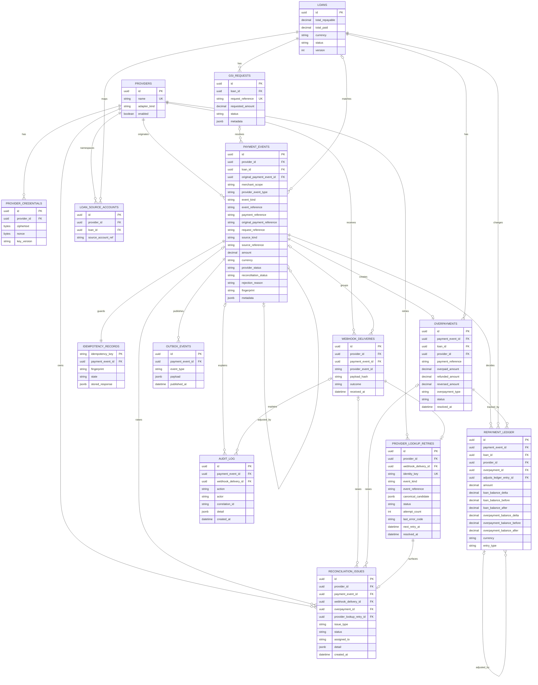

# ADR-001: Provider-aware, idempotent loan payment reconciliation

- **Status:** Accepted
- **Date:** 2026-08-17
- **Amended by:** [ADR-002](./0002-timeboxed-reconciliation-persistence-and-infrastructure-boundaries.md)

## Context

The current application is a deliberately small FastAPI, SQLAlchemy, SQLite,
and React exercise. It has a single `POST /webhooks/payments` stub, identifies a
payment only by `external_ref`, stores money as floating-point values, and has
no production-grade provider authentication or concurrency control.

The production-shaped system must accept successful repayment notifications
from multiple rails:

- Paystack card or transfer payments;
- Fincra virtual-account transfers associated with a loan or customer account;
- NIBSS GSI recoveries initiated earlier by CreditHub or a lender; and
- lender/core-banking notifications for money already collected.

These providers have different signatures, field names, status vocabularies,
account identifiers, and verification capabilities. A valid payment must be
matched, applied at most once, reflected in the loan balance, and made visible
to downstream systems and operators. Duplicate delivery, concurrent payments,
closed loans, unknown mappings, and overpayments are normal operating cases,
not exceptional code paths.

Providers may also deliver final-success reversals of earlier receipts and
refund results for unapplied overpayments. Those notifications use the same
webhook boundary and delivery audit trail. They are separate economic actions,
not status changes on the original payment.

The README currently says that every overpayment is rejected. This ADR adopts
the newer business rule: for an active loan, apply no more than its outstanding
balance and record the remainder as an overpayment. For this project's repayment
policy, `paid_off`, `cancelled`, and `written_off` are all closed/non-active
states: apply nothing, reject the reconciliation with a state-specific reason,
and record the whole confirmed receipt as a `closed_loan_payment` overpayment
awaiting refund.

## Decision drivers

1. A payment, reversal, or refund must never be applied twice, including during
   concurrent delivery.
2. Two distinct payments racing on one loan must never reduce its balance below
   zero.
3. Provider-specific concerns must not leak into the reconciliation domain.
4. Every trusted financial decision must be explainable and reconstructable.
5. Provider secrets and sensitive payload data must be handled safely.
6. Operators need actionable exceptions, not just a raw webhook feed.
7. The design should remain suitable for the existing modular monolith; a
   distributed microservice boundary is not required for this slice.

## Decision

### 1. Keep a modular monolith with ports and adapters

The webhook controller, provider adapters, reconciliation use case, repositories,
and admin query service will remain deployable as one FastAPI application. The
domain and application layers will depend on interfaces (ports), while Paystack,
Fincra, NIBSS, core-banking, PostgreSQL, Redis, encryption, and outbound message
implementations will be adapters.

The money-changing part remains synchronous and completes in one PostgreSQL
transaction. Non-critical downstream notifications use a transactional outbox
and are published after commit.

`ReconcilePaymentUseCase` is an application service, not a FastAPI service. It
accepts a framework-neutral reconciliation command/canonical financial event and returns
a framework-neutral result. It must not import or accept FastAPI `Request`,
`Response`, `Depends`, `HTTPException`, headers, or HTTP status codes. The HTTP
controller owns transport parsing and response mapping; repository ports and a
unit-of-work port provide persistence and the transaction boundary.

Core reconciliation by a background worker is not selected for this version.
Keeping the use case transport-independent preserves the option for a future
worker to invoke the exact same command without copying signature-independent
business rules. The currently selected worker is only the post-commit outbox
publisher.



This creates replaceable provider integrations without introducing a network
boundary inside the critical transaction. Synchronous describes the selected
driver and response timing; it does not mean the application use case is coupled
to FastAPI.

### 2. Use a provider path parameter and a provider adapter contract

The canonical endpoint is:

```text
POST /webhooks/payments/{provider}
```

The route uses the provider name only to select a configured adapter; it never
uses the value to construct an import or execute provider-controlled code.
Unknown or disabled providers are rejected before processing.

Each adapter implements the following application-facing capabilities:

```text
supported_media_types() -> set[MediaType]
verify_signature(raw_body, headers, provider_config) -> VerificationResult
decode(raw_body, media_type) -> ProviderPayload
normalize(provider_payload) -> CanonicalFinancialEvent
verify_with_provider(canonical_event, provider_config) -> LookupResult | NotSupported
resolve_source(canonical_event) -> provider-specific lookup hints
encode_acknowledgement(result) -> ProviderResponse
```

Signature verification is mandatory and operates on the exact raw request
bytes, using constant-time comparison and any provider timestamp/replay-window
rules. It runs before DTO parsing or business processing. If a provider uses XML
Digital Signature rather than an HTTP signature, its adapter performs only the
hardened XML canonicalization needed to verify that signature before business
normalization. A provider API lookup is an additional authenticity check when
the rail supports one. The local/demo adapter may call a dummy lookup endpoint
to exercise this branch.

Lookup outcomes have explicit persistence and response policies:

- `confirmed`: continue into synchronous reconciliation;
- transient network timeout, connection failure, `429`, or provider `5xx`:
  atomically persist the delivery, a unique `provider_lookup_retries` task, and
  an operational issue, then return the provider-compatible success/accepted
  response; no money is applied;
- provider lookup `401`/`403`: treat as a CreditHub credential/configuration
  incident using the same retry-task path, not as a borrower payment rejection;
- terminal provider `404` or provider-defined invalid-reference response:
  persist the delivery and one rejected financial event with the kind-specific
  reason `provider_payment_not_found`, `provider_reversal_not_found`, or
  `provider_refund_not_found`; create no repayment ledger row; and
- a confirmed lookup whose reference, source, amount, currency, or success state
  conflicts with the webhook: reject/quarantine it as
  `provider_verification_mismatch` and raise an operational issue.

Once a retry task is durably stored, returning `503` would unnecessarily combine
provider redelivery with CreditHub's own retry workflow. `503` is reserved for a
failure to durably store the delivery/retry task or another failure before the
request has been safely accepted.

Internal core-banking adapters may use an equivalent strong control such as
mTLS plus a signed message when no lookup API exists. They do not silently skip
authentication.

### 3. Decode JSON or XML, then normalize into one strict canonical DTO

The selected provider adapter owns the wire format. After authentication, the
controller normalizes the declared `Content-Type` (including optional charset)
and checks it against that adapter's explicit allowlist. Examples include
`application/json`, `application/xml`, `text/xml`, and a documented
provider-specific media type. An unsupported type returns `415`; the controller
does not guess between parsers from attacker-controlled body content.

JSON adapters decode with a strict JSON parser. The NIBSS GSI adapter can decode
XML with a hardened parser such as `defusedxml`, with DTDs, external entities,
and network resolution disabled and with request-size, nesting, and element-count
limits. It handles NIBSS namespaces and may validate against a pinned local XSD
when NIBSS publishes a stable schema. This prevents XXE/entity-expansion attacks
and avoids a generic XML-to-dictionary conversion silently changing repeated
elements, attributes, or namespaces.

Provider DTOs use Pydantic with `extra="allow"`. Required provider fields are
validated and known optional fields remain optional. Unexpected fields are
moved into a sanitized, JSON-compatible `metadata` object rather than discarded.
For XML, the adapter explicitly maps known elements/attributes and moves safe
unknown values into the same metadata structure. The canonical DTO is strict
and contains only domain-understood fields:

| Field | Purpose |
| --- | --- |
| `provider` | Stable provider identifier, also persisted as a first-class foreign key |
| `provider_event_id` | Identifies the delivery/event when the provider supplies one |
| `provider_event_type` | Original provider label, for example `charge.success` or `transaction.credit`; retained for traceability but not used directly as domain policy |
| `event_kind` | Normalized immutable action: `transaction.credit`, `transaction.reversal`, or `transaction.refund` |
| `event_reference` | Provider-stable reference for this payment, reversal, or refund action |
| `payment_reference` | Original payment reference; equal to `event_reference` for a normal payment |
| `original_payment_reference` | Required for reversal/refund events to find the original receipt |
| `request_reference` | Correlates an originating request, particularly a GSI request |
| `source_account_reference` | Originator, virtual, or lender account reference used to resolve a loan |
| `loan_reference` | Optional provider-supplied loan identifier; never trusted without mapping/validation |
| `amount` | Positive `decimal.Decimal` amount, quantized to the currency's allowed scale |
| `currency` | ISO 4217 currency code; initially `NGN` |
| `provider_status` | Canonical provider state such as `pending`, `succeeded`, or `failed` |
| `channel` | Canonical rail/channel enum |
| `occurred_at` | Provider transaction time normalized to UTC |
| `metadata` | Sanitized JSON object containing optional and unknown fields |

The canonical model includes a schema version and always serializes to the same
JSON shape, regardless of whether its source was JSON or XML. Because JSON has no
decimal type, money is serialized as a fixed-point string, never a JSON binary
floating-point number. For example:

```json
{
  "schema_version": "1.0",
  "provider": "nibss_gsi",
  "provider_event_type": "credit.notification",
  "event_kind": "transaction.credit",
  "event_reference": "GSI-2026-000184",
  "payment_reference": "GSI-2026-000184",
  "request_reference": "REQ-90128",
  "source_account_reference": "tokenized-account-reference",
  "amount": "12500.00",
  "currency": "NGN",
  "provider_status": "succeeded",
  "channel": "gsi",
  "occurred_at": "2026-08-17T10:30:00Z",
  "metadata": {}
}
```

Inbound decoding and outbound acknowledgement encoding are separate. If NIBSS
requires an XML acknowledgement, the NIBSS adapter may serialize that transport
response as XML while the persisted and downstream `CanonicalFinancialEvent` remains
the same JSON-compatible model used for every provider.

Only a provider-defined final-success state can enter monetary reconciliation.
Verified pending/failed callbacks are retained as delivery/operational facts and
acknowledged without changing a loan. Adapters map provider-specific labels such
as `transaction.credit`, `charge.success`, or `transfer.reversed` into the same
canonical `transaction.credit`, `transaction.reversal`, or
`transaction.refund` enum before invoking an event-kind-specific domain policy.

The loan is deliberately component-agnostic in this scope. Reconciliation
applies one `Decimal` amount against one aggregate outstanding balance; it does
not allocate among principal, interest, penalties, or fees.

Money is never represented as `float` or constructed with `Decimal(float)`.
Adapters parse source strings/integers directly into `decimal.Decimal`; domain
entities, calculations, DTOs, repository parameters, ledger values, and tests
also use `Decimal`. PostgreSQL persists monetary columns as `NUMERIC(20, 2)`
(SQLAlchemy `Numeric(20, 2, asdecimal=True)`) for the initial NGN-only scope.
Values with excess scale are rejected rather than silently rounded unless a
separate business rule explicitly authorizes rounding. This keeps arithmetic and
JSON/database round trips exact.

### 4. Separate delivery identity from economic-action identity

Webhook redelivery and economic-action identity are related but different:

- `webhook_deliveries` is append-only and records every attempt, including an
  invalid signature, malformed payload, and a duplicate delivery. Untrusted
  payloads are represented by a hash and safe diagnostic fields rather than
  being treated as payment events.
- `payment_events` has exactly one canonical row per trusted economic action,
  including an application, reversal, or overpayment refund.
  Multiple deliveries may point to the same event.

The durable economic identity is:

```text
provider_id + merchant_scope + event_kind + event_reference
```

The durable idempotency/identity key is a SHA-256 digest of the provider,
merchant scope, immutable event kind, and event reference. Its stored immutable
fingerprint is a separate SHA-256 digest of canonical, length-delimited values:

```text
provider_id | merchant_scope | event_kind | event_reference |
original_payment_reference |
source_kind | source_reference | canonical_decimal_amount | currency
```

`source_kind` identifies a provider loan reference, source account, or GSI
request, and `source_reference` is the corresponding normalized value. This
ensures the loan/account context is included even when the originator does not
know CreditHub's internal loan ID. The amount is quantized and rendered at the
currency's fixed scale before hashing, so `100`, `100.0`, and `100.00` cannot
produce different fingerprints for the same NGN amount.

`provider_status` is intentionally excluded: a provider may legitimately send
`pending` and later `succeeded` for the same payment. If a repeated economic
identity has the same fingerprint, it is an idempotent replay and the stored
outcome is returned. If it has a different fingerprint, it is an
`identity_conflict`; it is never applied and an operator alert is created.

`provider_event_type` and `event_kind` are deliberately separate. The former is
what the provider called the event; the adapter maps it to the latter so the
domain never branches on provider vocabulary. Canonical `event_kind` is not a
status: it identifies a distinct immutable economic action, so a credit and a
later reversal/refund remain separate idempotent events even when the provider
relates them with the original payment reference.

If a provider exposes only a request/event ID, an adapter may use it as
`event_reference` only when the provider contract guarantees that it is stable
across redelivery and unique for that economic action. A provider that reuses the
original payment reference for a reversal/refund must supply a stable provider
event ID or adjustment reference when multiple actions of that kind are possible.
Otherwise the event is quarantined; kind, amount, and account alone are not safe
substitutes for identity.

PostgreSQL enforces all of the following:

- unique `(provider_id, merchant_scope, event_kind, event_reference)` on
  canonical financial events;
- unique `idempotency_key` on durable idempotency records;
- unique `(payment_event_id, entry_type)` on repayment ledger entries, allowing
  one credit to produce both a repayment component and an overpayment component;
  and
- unique `payment_event_id` on overpayment records.

This is stronger than only making `(payment_reference, amount, account)` unique:
that composite would permit a reused reference when the sender changes the
amount or account. Those values are instead stored in the fingerprint and must
match the original event.

Redis is used only as a TTL cache for completed idempotency lookups:
`identity key -> fingerprint + stored response`. It is populated after the
database commit. A cache hit is replayable only when fingerprints match; a
mismatch is checked against PostgreSQL and raised as an identity conflict. A
miss, eviction, or Redis outage always falls back to PostgreSQL. Redis does not
store the authoritative idempotency record, lock a loan, cache an authoritative
loan balance, or decide whether money is applied.

### 5. Serialize every financial event in PostgreSQL

The winning request performs the following in one transaction:

1. insert/claim the durable idempotency record in `processing` state;
2. for a payment, map the source to a loan; for a reversal/refund, resolve and
   validate the original payment and related ledger/overpayment;
3. lock the matched loan row first, followed by the original ledger and
   overpayment rows when applicable;
4. calculate the event-kind-specific application, reversal, or refund outcome;
5. insert the canonical financial event once with its final reconciliation
   status and original-event links;
6. insert/link the append-only webhook-delivery fact;
7. insert any new overpayment projection row required by the decision;
8. append the event's successful repayment, overpayment, reversal, or refund
   component rows to the repayment ledger;
9. update the loan and overpayment projections from those component results;
10. finalize the idempotency result;
11. append audit and outbox rows; and
12. commit all rows together.

The idempotency record is workflow state and may transition from `processing` to
`completed` inside the transaction. A canonical financial event is not workflow
scratch space: pending/failed provider callbacks live in `webhook_deliveries`,
and a reconciled event is inserted only after its final decision is known. The
runtime role cannot update or delete event, ledger, delivery, or audit facts.

A competing insert for the same economic action is resolved by the unique
constraint. A different event affecting the same loan waits on the loan row lock
and then recalculates against the new balance and related records. The result is
effectively-once financial mutation even though HTTP delivery itself remains
at-least-once.

SQLite cannot prove the row-locking behavior and does not provide PostgreSQL's
exact `NUMERIC` semantics through the same driver path. PostgreSQL is therefore
required for monetary and concurrency correctness tests and should be the local
development default. SQLite may remain only for explicitly non-authoritative
legacy smoke tests.

### 6. Use an append-only repayment balance journal, not a full general ledger

The existing `repayments` table is already ledger-like. It will become an
append-only `repayment_ledger` whose rows describe both the amount applied to a
loan and the amount held as overpayment. It is the replayable financial history;
the loan and overpayment tables are current-state projections.

```text
amount
loan_balance_delta
loan_balance_before
loan_balance_after
overpayment_balance_delta
overpayment_balance_before
overpayment_balance_after
entry_type
adjusts_ledger_entry_id
provider_id
payment_event_id
loan_id
overpayment_id
currency
created_at
```

For an active loan with a balance of NGN `60.00` and a valid NGN `100.00`
credit, the same successful `transaction.credit` event produces two ledger rows:

- `repayment`: amount `Decimal("60.00")`, loan balance delta
  `Decimal("-60.00")`, loan balance before `Decimal("60.00")`, and after
  `Decimal("0.00")`; and
- `overpayment`: amount `Decimal("40.00")`, loan balance delta
  `Decimal("0.00")`, and overpayment balance delta `Decimal("40.00")`, linked
  to the matching `overpayments` row.

Thus the event gross amount remains `Decimal("100.00")`, while the sum of its
successful `repayment` and `overpayment` component rows is also
`Decimal("100.00")`. For a `paid_off`, `cancelled`, or `written_off` loan, no
`repayment` component is written; one `overpayment` ledger row records the full
credit and the payment event retains the state-specific reconciliation result.

Finite `entry_type` values initially include `repayment`, `overpayment`,
`repayment_reversal`, `overpayment_reversal`, and `overpayment_refund`.
Provider-pending/failed events and events rejected before any money can be
accepted do not create ledger rows; therefore every ledger row is a final
successful monetary fact. A provider-successful credit rejected only for loan
application, such as a closed-loan receipt, does create an `overpayment` row.

Rows are never edited or deleted. If an authorized data correction is ever
required, it is a new compensating adjustment referencing the original.
Database permissions, and optionally triggers, prohibit ordinary application
roles from updating or deleting canonical event, ledger, webhook-delivery, and
audit rows.

Each successful canonical `transaction.reversal` is a new payment event. It is
valid only when it unambiguously references a pre-existing, final-success
`transaction.credit` event with at least one committed `repayment` or
`overpayment` ledger component. A missing, provider-pending/failed, already fully
reversed, or ambiguous original is quarantined and produces no ledger row.
The initial scope accepts full reversals only; unsupported partial reversals are
also quarantined.

For reversal eligibility, “successful” means the original provider transaction
was verified and normalized with `provider_status = succeeded` and produced at
least one committed ledger component. It does not require the credit's
`reconciliation_status` to be `applied`: a closed-loan credit may be rejected for
loan application while still being a successful, reversible overpayment.

The reversal appends one compensating row for each component it reverses. A
`repayment_reversal` references the original `repayment` row and has a positive
loan balance delta, restoring the amount previously applied. An
`overpayment_reversal` references the original `overpayment` row and has a
negative overpayment balance delta, removing funds that are no longer available
to refund. The original rows remain unchanged. The loan's `total_paid` projection
is decreased, and a `paid_off` loan reopens to `active` when its restored
outstanding becomes positive. If the loan was subsequently `cancelled` or
`written_off`, that operational status is preserved and an issue is raised.

A reversal received after any related overpayment refund is quarantined for
manual investigation; it must not silently restore the loan while also reversing
funds that have already left through a refund.

A successful canonical `transaction.refund` webhook references the original
successful credit and its existing overpayment. It locks the loan and
overpayment, validates provider/currency and
`refund_amount <= current_overpayment_balance`, and appends an
`overpayment_refund` ledger row with a negative overpayment balance delta. It
does not change the loan balance because this component was never applied to the
loan. Partial refunds are allowed when each callback has a stable unique refund
reference. Pending/failed refund callbacks remain delivery/operational facts and
produce no ledger row.

`loans.total_paid` is retained as a transactionally updated `Decimal` read model for
fast servicing queries. It is not the only evidence of balance. A scheduled
invariant check compares it with the sum of ledger applications, adjustments,
and compensating entries.

Overpayments are refund candidates, not new loan allocations. The
`overpayments` table is a projection with exactly two statuses: `active` while
its replayed balance is positive, and `refunded` once its replayed balance is
zero. Partial refunds remain `active`; failed/pending refund attempts do not
change the status. A full refund or a provider reversal of the overpayment
component makes it `refunded`. `refunded_amount` and `reversed_amount` retain the
resolution split, while the ledger remains authoritative. Initiating a refund
may remain outside this service, but processing its authenticated provider
webhook result is in scope.

This journal is warranted because the system makes regulated, disputable money
decisions and must explain every balance transition. A double-entry accounting
general ledger is **not** selected here: the service is allocating confirmed
receipts to loans, not owning the complete cash, receivable, settlement, refund,
and treasury books. If CreditHub later owns those books, these events should
feed a dedicated double-entry ledger rather than stretching this table into one.

### 7. Make provider and reconciliation state first-class data

The target logical data model is:



Foreign keys make provider awareness a first-class, indexable dimension rather
than hiding it only in JSON metadata. All finite state/type fields use matching
Python enums and PostgreSQL enums or explicit database check constraints. JSONB
holds optional provider metadata, not core query or integrity fields.

`loan_source_accounts` has a composite unique constraint on
`(provider_id, source_account_ref)`; an account identifier is not assumed to be
globally unique across providers.

`payment_events.loan_id` is nullable until matching completes so that unknown or
ambiguous sources can still be retained and surfaced to operators.

`provider_lookup_retries` has at most one unresolved row per economic identity.
It stores only the sanitized canonical candidate needed to repeat verification,
never provider credentials or an unsanitized raw payload. Each retry attempt and
admin action appends an audit record. An authorized admin retrigger claims a
short lease, performs the provider call outside any money-changing transaction,
and, if confirmed, invokes the same framework-neutral
`ReconcilePaymentUseCase`. The subsequent financial application remains
synchronous and database-idempotent.

### 8. Encrypt provider configuration and minimize secret exposure

Provider verification secrets/public keys and lookup API credentials are stored
as versioned AES-256-GCM ciphertext with a random nonce and provider-specific
additional authenticated data. A small credential service decrypts only the
selected provider's configuration and returns a short-lived in-memory object.
Secrets are never logged, placed in Redis, returned by admin APIs, or copied into
audit metadata.

For local development, the base64-encoded key-encryption key is supplied through
an environment variable such as `RECONCILIATION_CONFIG_KEK`. In production the
deployment platform injects it from a remote secrets vault during CI/CD or at
workload startup. Prefer a KMS/HSM-backed envelope key in production so key
material need not be delivered directly to the application. Ciphertext stores a
key version so credentials can be re-encrypted during rotation.

Incoming signature values are not provider secrets. If retained for forensic
purposes, store a one-way digest or redacted form with the delivery record.

### 9. Treat operations and observability as part of reconciliation

The admin dashboard reads purpose-built, authenticated query endpoints rather
than computing all metrics from an unbounded raw feed. It puts unresolved issues
first and supports filtering by time, provider, channel, reason, and loan.

At minimum it displays:

- received, applied, partially applied, and rejected counts;
- successful and quarantined reversal/refund counts, with the original payment
  and affected loan or overpayment visible;
- gross received, amount applied, active overpayment, and refunded totals;
- failure/rejection rate and processing latency;
- duplicate deliveries and identity conflicts;
- provider lookup retry tasks with attempt count, last error, age, next retry,
  and an authorized manual retrigger action;
- rejected or quarantined items grouped by actionable reason, including terminal
  provider `not_found` results; and
- a drill-down timeline joining delivery, canonical event, loan decision,
  lookup attempts, ledger entry, overpayment/refund status, and audit activity.

Invalid signatures are security telemetry, not ordinary rejected repayments.
The browser never contains a provider webhook secret. Synthetic payment controls
are development-only or call a separately authenticated admin simulation API.

## Required invariants

The implementation and database constraints must preserve these invariants:

1. Event and ledger `amount` values are positive `Decimal` values;
   `refunded_amount` and `reversed_amount` are non-negative; loan and
   overpayment balances never go below zero.
2. A canonical economic action has at most one reconciliation decision for its
   `(provider, merchant_scope, event_kind, event_reference)` identity.
3. Every ledger row with a loan effect satisfies
   `loan_balance_after = loan_balance_before + loan_balance_delta`. Every row
   with an overpayment effect satisfies
   `overpayment_balance_after = overpayment_balance_before + overpayment_balance_delta`.
4. For a successful canonical credit, the event amount equals the sum of its
   positive `repayment` and `overpayment` ledger component amounts.
5. A loan becomes `paid_off` exactly when its locked outstanding balance becomes
   zero; any confirmed receipt for a non-active loan applies zero and becomes a
   full `closed_loan_payment` refund candidate.
6. A reversal must reference a pre-existing final-success
   `transaction.credit` event and its committed `repayment` and/or `overpayment`
   rows. Each original component can be fully reversed at most once, and only by
   new compensating rows.
7. For each overpayment,
   `remaining = overpaid_amount - refunded_amount - reversed_amount` and also
   equals the sum of its ledger `overpayment_balance_delta` values. Status is
   `active` exactly when `remaining > 0` and `refunded` exactly when it is zero.
   A refund ledger row always has zero loan balance delta.
8. A transient or configuration-related provider lookup failure cannot create a
   ledger row or change a loan; it creates/reuses one durable retry task.
9. A payment event, ledger decision, loan projection update, overpayment/issue,
   audit record, and outbox event either commit together or do not commit.
10. Ledger and audit history is append-only; corrections are compensating rows.
11. Cache contents never determine whether money is applied.

## Consequences

### Positive

- Duplicate and concurrent delivery are safe at the database boundary.
- Provider integrations can evolve independently behind a stable canonical DTO.
- Balance history, overpayment decisions, and provider provenance are auditable.
- Authenticated reversals and overpayment refunds are traceable back to the
  original provider event without rewriting financial history.
- Redis loss and downstream broker outages do not compromise reconciliation.
- The dashboard can explain both the current balance and the operational issue
  that produced it.

### Costs and trade-offs

- PostgreSQL, migrations, row-lock integration tests, and an outbox worker add
  more infrastructure than the current SQLite demo.
- Native database enums require deliberate expand-before-use migrations; check
  constraints may be operationally easier when values change often.
- Provider lookups increase latency and require durable retry tasks, admin
  controls, leases, and monitoring.
- Append-only correction flows require explicit compensating adjustments instead
  of direct row edits.
- Reversal/refund processing adds cross-event validation and deterministic lock
  ordering; conflicting or unsupported adjustments require an operator issue.
- Delivery records add storage; payload retention, redaction, and partitioning
  policies are required.

## Alternatives considered

### A single handler with provider `if/else` branches

Rejected. It is quick for one provider but couples authentication, parsing,
mapping, and domain policy. It becomes hard to test and risky to extend.

### Redis locks or cached idempotency as the primary guarantee

Rejected. Eviction, expiry, failover, or a split-brain condition can re-apply
money. PostgreSQL unique constraints and transactions are authoritative.

### A unique constraint only on reference, amount, and account

Rejected as the sole identity rule. Changing any one of those fields evades the
constraint. A unique provider-scoped event kind/reference plus immutable
fingerprint comparison detects that conflict while allowing a reversal or refund
to reference, but not impersonate, the original payment.

### Mutating a repayment row when a correction arrives

Rejected. It destroys the history needed to explain a prior loan balance and
operator action.

### A full double-entry general ledger in this service

Not selected. This bounded context reconciles receipts and maintains loan
balances; it does not own the accounting books or cash settlement. An append-only
repayment application journal plus overpayment records is sufficient and much
clearer.

### Mandatory provider lookup for every adapter

Rejected as a universal rule because some trusted internal rails do not expose a
lookup API. Every adapter must perform signature or equivalent strong transport
authentication; lookup is mandatory when configured and supported.

## Explicit scope decisions

- `paid_off`, `cancelled`, and `written_off` are closed/non-active for repayment;
  a confirmed receipt is rejected and its full amount becomes an overpayment
  awaiting refund. There is no separate suspense-account workflow.
- Loans expose one aggregate outstanding balance. Principal, interest, penalty,
  and fee allocation is not part of this system.
- Transient/configuration lookup failures enter `provider_lookup_retries` and the
  admin issue queue. Terminal event-not-found results create a rejected event
  with a payment/reversal/refund-specific reason.
- Final-success provider-originated payment reversals and overpayment refunds are
  processed through the same authenticated, lookup-aware, idempotent webhook
  boundary. Reversals and refunds append compensating repayment-ledger rows;
  overpayment refund rows affect only the overpayment balance and projection,
  not the loan. Pending/failed callbacks are retained without a financial
  mutation.
- Initial scope supports full payment reversals and partial or full overpayment
  refunds when each action has a stable provider event reference. Refund
  initiation/disbursement may remain external; this service processes the
  resulting provider webhook and records its outcome.

## Amendment: automated overpayment refund delivery and lookup retries

The transactional outbox is the single durable dispatch queue for generic
post-commit notifications and refund commands. The outbox publisher is the only
process that leases and retries rows. It routes exact event types through
`OUTBOX_EVENT_URLS`, falling back to `DOWNSTREAM_NOTIFICATION_URL` for unmapped
notification types. A core-banking overpayment creates one
`overpayment.refund.requested` command atomically with the financial decision;
the publisher delivers that command to the refund orchestrator webhook. The
orchestrator validates the event type and ignores any other event; it never polls
or claims `outbox_events`. On a valid command it never writes a loan, ledger,
payment event, or overpayment projection directly. A successful provider refund
confirmation re-enters through the normal authenticated provider boundary as
canonical `transaction.refund`, which changes only the overpayment balance. It is never represented as
`transaction.reversal`, because a reversal can compensate a repayment component
and reopen a loan.

For the timeboxed demo, the refund webhook uses a signed core-banking loopback
as a test double. Production replaces that adapter with the documented outbound
core-banking refund API without changing the durable command, publisher retry,
idempotency, or confirmation rules.

The scheduled lookup-retry runner is an accepted driving adapter alongside the
staff retry command. It claims retries using leases and invokes the same
`ReconcilePaymentUseCase`; it does not implement reconciliation or mutate
financial records directly.

## Remaining configuration decisions

1. Whether each provider's payment reference is unique per merchant, per
   account, or globally, so `merchant_scope` can be configured correctly.
2. Provider-specific retry limits/backoff and exact response code expected after
   a retry task has been durably accepted.
3. Payload retention, PII redaction, encryption, and regulatory retention periods.
4. The stable reversal/refund reference and original-payment correlation fields
   supplied by each provider, including whether a provider can emit partial
   reversals. Partial reversals remain quarantined until explicitly designed.
