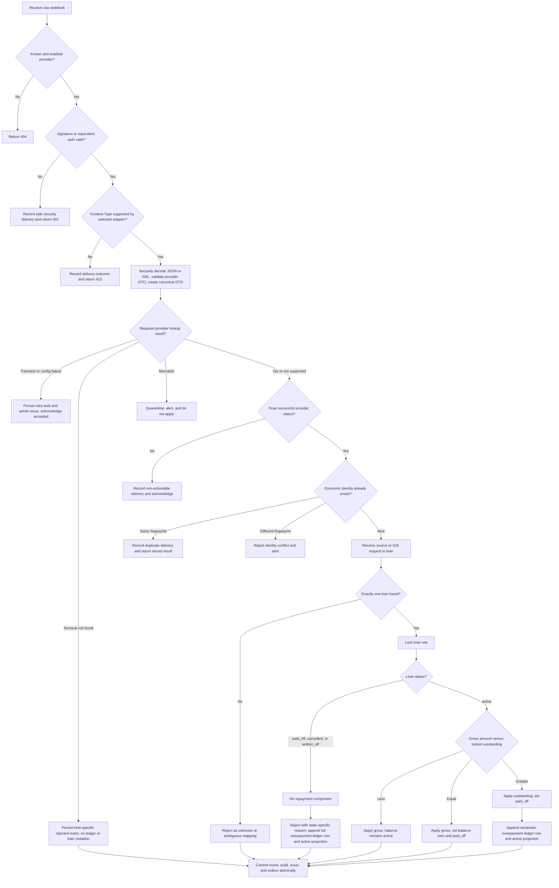
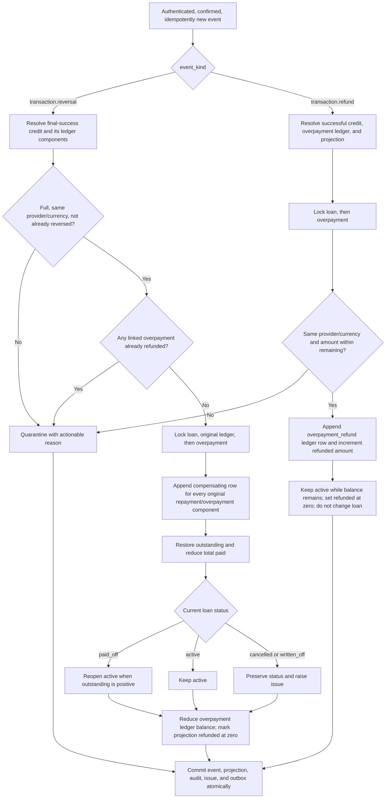
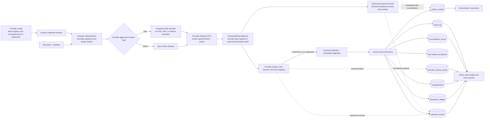
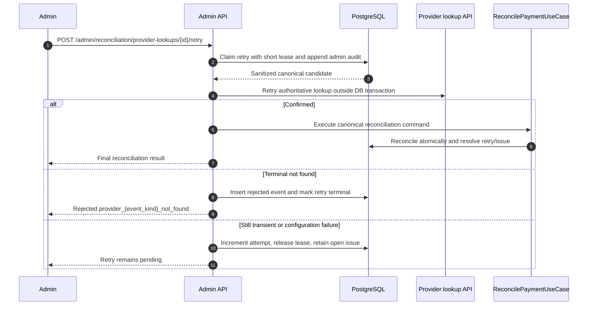

# Payment reconciliation implementation plan

This plan implements [ADR-001](adr/0001-provider-aware-payment-reconciliation.md) with
[ADR-002](adr/0002-timeboxed-reconciliation-persistence-and-infrastructure-boundaries.md)
amendments against the current FastAPI/SQLAlchemy/React repository. It separates the
smallest demonstrable vertical slice from production hardening so the existing
one-to-two-day take-home timebox remains honest.

> **For This Timeboxed implementation, note:** the submitted slice keeps provider
> configuration in an in-memory demo registry and uses PostgreSQL canonical-event
> uniqueness, immutable fingerprints, transactions, and row locking as the
> authoritative idempotency/concurrency boundary. Encrypted provider credential
> storage and a Redis completed-result cache remain production hardening items.
> Neither is required for financial correctness in the submitted implementation.

## 1. Intended outcome

A provider can submit a signed, successful payment, payment-reversal, or
overpayment-refund notification to
`POST /webhooks/payments/{provider}`. The application authenticates the exact
request, optionally confirms it with the provider, normalizes it, durably
deduplicates it, resolves its original financial context, and atomically records
the decision. Payments apply no more than the locked outstanding balance;
reversals append a compensating balance entry; refunds consume only an existing
unapplied overpayment through a compensating ledger entry. All results and
actionable issues are exposed to an authenticated admin dashboard.

The guarantee is **effectively-once financial application on top of at-least-once
webhook delivery**. The API does not claim network-level exactly-once delivery.

## 2. Original baseline and target change

| Concern | Original repository | Target |
| --- | --- | --- |
| Webhook | `POST /webhooks/payments` returns `501` | Provider-routed, signed endpoint with a temporary compatibility alias if needed |
| Authentication | Shared constant token; also embedded in the browser | Provider signature/equivalent authentication; provider-native secrets remain server-side; the legacy demo token is retained only for the compatibility simulator |
| Input | One JSON-only, fixed `PaymentIn` model | Provider-aware JSON/XML decoding, provider DTO, then one canonical JSON-compatible DTO with extras in JSONB metadata |
| Money | SQLAlchemy `Float` and Python `float` | `decimal.Decimal` throughout Python and `NUMERIC/DECIMAL` throughout PostgreSQL |
| Identity | `external_ref` is not unique | Provider-scoped economic identity, immutable fingerprint, DB uniqueness/locking, with an optional completed-result cache as a production fast path |
| Concurrency | No transaction or row lock | PostgreSQL transaction, unique claim, `SELECT FOR UPDATE` on loan |
| History | Mutable loan aggregate plus basic `Repayment` | Append-only repayment decision journal with before/after balance |
| Overpayment | README says reject whole event | Apply outstanding amount and record the remainder in both the ledger and an `active` overpayment projection; do the same for the full receipt on a non-active loan |
| Adjustments | No provider reversal/refund handling | Idempotent reversal/refund events append compensating ledger rows; refund rows affect overpayment balance without changing loans |
| Provider mapping | Caller supplies a trusted `loan_id` | GSI request and provider/source-account mappings; caller value is only a hint |
| Database | SQLite and `create_all` | Alembic-managed PostgreSQL for local, test, and production monetary paths |
| Operations | Raw feed and balances | Summary health, issue queue, drill-down, filters, and audit trail |

## 3. Contract decisions to freeze before implementation

These decisions should become API examples and tests before application code is
written:

1. The canonical route is `POST /webhooks/payments/{provider}`. During the
   exercise, the old `/webhooks/payments` route may remain as a deprecated alias
   for the demo `paystack` adapter so the provided frontend and tests can be
   migrated without an all-at-once break.
2. Authentication uses the raw body. Invalid signature returns `401` (matching
   the existing public contract), unknown/disabled provider returns `404`,
   an adapter-unsupported `Content-Type` returns `415`, malformed authenticated
   content returns `422`, and a failure to durably accept the request/retry task
   returns retryable `503`.
3. A completed exact replay returns `200` and the original stored business
   result with `idempotent_replay: true`. It does not create a second payment
   event or ledger row, but it does create a delivery/audit fact.
4. A reused event reference for the same provider, merchant scope, and immutable
   event kind with a different fingerprint returns a
   stable rejected result with reason `identity_conflict`, raises an operational
   issue, and never applies the second body.
5. A valid active-loan payment below or equal to outstanding is `applied`. A
   payment above outstanding is `partially_applied`, closes the loan, and creates
   an `active_loan_remainder` overpayment. A confirmed payment for any non-active
   loan (`paid_off`, `cancelled`, or `written_off`) is rejected with a
   state-specific reason and creates a full `closed_loan_payment` overpayment in
   `active` status. Every overpayment amount is also represented by an
   `overpayment` repayment-ledger row.
6. A verified callback whose provider status is not final success is recorded as
   a non-actionable delivery and acknowledged; it does not enter loan
   reconciliation.
7. After authentication, the provider adapter selects a decoder from its
   allowlisted media types. Paystack/Fincra/core-banking adapters may accept
   JSON, while NIBSS GSI may accept XML. Both paths produce the same versioned
   canonical model and JSON serialization. A provider-specific response encoder
   may return an XML acknowledgement to NIBSS without changing that internal
   representation.
8. A transient/configuration provider lookup failure is durably accepted into
   `provider_lookup_retries`, linked to an admin issue, and acknowledged with the
   provider-compatible success/accepted response. A terminal payment, reversal,
   or refund `404`/invalid reference creates a rejected event with a
   kind-specific reason and no ledger row. Return `503`
   only if the delivery/retry task cannot be committed.
9. The response reports the gross, applied, and overpaid amounts separately.
   JSON money values are fixed-point strings so they round-trip to `Decimal`
   exactly:

   ```json
   {
     "event": {"id": "...", "status": "partially_applied"},
     "reconciliation": {
       "gross_amount": "100.00",
       "applied_amount": "60.00",
       "overpaid_amount": "40.00",
       "reason": "active_loan_remainder",
       "idempotent_replay": false
     },
     "loan": {"id": "...", "outstanding": "0.00", "status": "paid_off"}
   }
   ```

10. Each adapter retains the provider's original event label as
    `provider_event_type`, then maps it to canonical `event_kind`:
    `transaction.credit`, `transaction.reversal`, or `transaction.refund`.
    Canonical kind is part of identity because it describes an immutable
    economic action, not a mutable status. Each reversal/refund also carries its
    own stable `event_reference` and the original payment reference.
11. Initial scope processes final-success full payment reversals only when they
    reference a pre-existing final-success `transaction.credit` event with at
    least one committed `repayment` or `overpayment` ledger component. It appends
    compensating component rows, restores the amount originally applied, and
    reopens a `paid_off` loan when the restored balance is positive. Missing,
    provider-unsuccessful, ambiguous, partial, already-reversed, or post-refund
    reversals are quarantined. “Successful original” refers to verified
    `provider_status = succeeded` plus a committed component row, so a
    closed-loan overpayment remains eligible even if its reconciliation outcome
    was rejected for application to the loan.
12. A final-success overpayment refund may be partial or full when it has a
    stable unique refund reference. It increments the linked overpayment's
    `refunded_amount`, appends an `overpayment_refund` repayment-ledger row, and
    does not alter the loan. The overpayment remains `active` until its ledger
    balance reaches zero, then becomes `refunded`. A true refund is distinct
    from `transaction.reversal`: it must never compensate a repayment component
    or reopen a loan.
13. For the timeboxed core-banking demo, a newly created core-banking
    overpayment creates one durable `overpayment.refund.requested` event in
    `outbox_events`. The outbox publisher routes that exact event type to the
    refund-runner webhook, which validates the type before it POSTs a signed,
    provider-native test callback to this service's own
    `POST /webhooks/payments/core_banking` route using
    `event: overpayment.refunded`, a new `notification_id`, the original
    payment's `original_notification_id`, and the requested refund amount. The
    core-banking normalizer maps that label to canonical `transaction.refund`.
    This loopback is a test double for the documented outbound core-banking
    refund API that production will call; it is not a claim that production
    providers accept inbound webhooks from us. The initial scope is limited to
    overpayments whose original credit is also from `core_banking`, because the
    current refund correlation requires the same provider and merchant scope.
14. Every callback attempt creates an append-only `webhook_deliveries` fact,
    including payment, reversal, refund, pending, failed, duplicate, malformed,
    and invalid-signature attempts. Only authenticated, safely parsed deliveries
    may link to canonical financial events; unsafe bodies are represented by a
    digest and redacted diagnostics.

The existing test that expects an active-loan overpayment to be rejected in full
must change because it conflicts with the newer allocation rule. The duplicate
test must also assert one canonical payment event plus a second delivery/issue
fact, rather than requiring a second rejected payment event; the latter would
conflict with the requested database uniqueness defense.

### Redis scope

Redis is an optional completed-idempotency-result cache and is not required for
financial correctness. The timeboxed implementation relies on PostgreSQL
canonical-event uniqueness, immutable fingerprints, transactions, and loan-row
locking as the authoritative idempotency and concurrency boundary.

A production deployment can add Redis as a fast path after a successful
PostgreSQL commit, caching `identity key -> fingerprint + stored response` with a
TTL so exact redeliveries can be answered without repeating the full database
lookup path. A miss, mismatch, eviction, concurrent cache miss, or Redis outage
must fall back to PostgreSQL. Redis must not own durable event identity, lock a
loan, hold an authoritative loan balance, or decide whether money is applied.

## 4. Target request sequence

```mermaid
sequenceDiagram
    autonumber
    participant Rail as Payment rail
    participant API as Webhook controller
    participant Adapter as Provider adapter
    participant Lookup as Provider lookup API
    participant Cache as Redis completed-result cache (optional)
    participant DB as PostgreSQL
    participant Worker as Outbox worker

    Rail->>API: POST /webhooks/payments/{provider}<br/>raw body, headers
    API->>API: Resolve configured provider credentials
    API->>Adapter: Verify raw signature using scoped provider config

    alt Signature invalid
        API->>DB: Append safe invalid-signature delivery record
        API-->>Rail: 401
    else Signature valid
        API->>Adapter: Validate Content-Type and securely decode JSON or XML
        Adapter->>Adapter: Validate provider DTO and normalize canonical DTO
        opt Provider lookup is configured
            Adapter->>Lookup: Fetch authoritative payment
            Lookup-->>Adapter: Reference, account, amount, currency, status
            Adapter->>Adapter: Compare canonical immutable fields
        end

        alt Lookup timeout, 429, 5xx, or credential/config failure
            API->>DB: Commit delivery, unique lookup-retry task, and issue
            API-->>Rail: Provider-compatible 200/202 accepted
        else Terminal financial event not found or invalid reference
            API->>DB: Commit delivery and rejected event, no ledger row
            API-->>Rail: Stable non-applied response
        else Lookup mismatch
            API->>DB: Append quarantined delivery and operational issue
            API-->>Rail: Stable non-applied response
        else Authenticated and confirmed
            alt Provider status is not final success
                API->>DB: Append non-actionable delivery
                API-->>Rail: 200 acknowledged, no loan mutation
            else Final successful financial event
                opt Redis completed-result cache is configured
                    API->>Cache: GET cached fingerprint and completed result
                    Cache-->>API: Cached result or miss
                end
                alt Optional cache hit and fingerprint matches
                    API->>DB: Append duplicate delivery fact
                    API-->>Rail: 200 stored result, replay=true
                else No cache, cache miss, or fingerprint mismatch
                    API->>DB: BEGIN and check/claim canonical event identity
                    alt Existing identity and same fingerprint
                        DB-->>API: Existing committed event/result
                        API->>DB: Append duplicate delivery fact and COMMIT
                        API-->>Rail: 200 stored result, replay=true
                    else Existing identity and different fingerprint
                        API->>DB: Append identity-conflict issue and COMMIT
                        API-->>Rail: 200 rejected conflict
                    else New economic action
                        API->>DB: Resolve loan and original event/overpayment as required
                        API->>DB: Lock loan, then related ledger/overpayment rows
                        API->>DB: Calculate outcome; insert/link delivery and final event
                        API->>DB: Insert event-kind-specific ledger component rows
                        API->>DB: Update loan or overpayment projection as applicable
                        API->>DB: Insert audit and outbox rows
                        API->>DB: COMMIT
                        opt Redis completed-result cache is configured
                            API->>Cache: SET completed result with TTL
                        end
                        API-->>Rail: 200 committed result
                        DB-->>Worker: Poll unpublished outbox rows
                        Worker-->>Worker: Publish canonical financial result event
                    end
                end
            end
        end
    end
```

Provider lookup runs before opening the money-changing transaction. Network I/O
must not hold a loan lock. Signature validation still happens first.

## 5. Reconciliation decision flows

### Payment application



Unknown/ambiguous mappings are retained as issues but do not create a loan ledger
row because no loan can yet be named. A future operator resolution must be a
separate, audited command that re-enters the same reconciliation use case.

### Reversal and refund adjustments



Locking the loan before the original ledger/overpayment rows gives all payment,
reversal, and refund paths one deterministic lock order. Pending or failed
provider callbacks stop before this flow and remain delivery/operational facts.

## 6. Canonical data flow



Core identifiers and `Decimal` amounts are first-class columns. JSONB metadata
is for provider-specific optional data only and is sanitized before persistence.
`CanonicalFinancialEvent` is the one internal contract; `CJSON` is its stable
JSON-compatible representation for JSONB and downstream events, not a second
provider-specific model.

## 7. Delivery milestones

### Milestone 0 - Freeze behavior and establish the test harness

Tasks:

- Add representative JSON fixtures for Paystack/Fincra/core banking and XML
  fixtures for NIBSS GSI, covering payment, reversal, refund, success,
  redelivery, failure, optional/extra metadata, namespaces, and malformed
  payloads.
- Confirm ADR-001's explicit scope decisions and configure provider reference
  scope, retry/backoff limits, and retention policy.
- Define canonical enums and a rejection-reason catalogue before migrations.
- Add a PostgreSQL integration-test service. Keep fast unit tests independent of
  infrastructure; mark PostgreSQL concurrency tests separately.
- Add Alembic and stop relying on `Base.metadata.create_all` outside disposable
  tests.

Exit criteria: API contract fixtures, status/reason catalogue, and database test
harness are reviewed and executable.

### Milestone 1 - Correct money and persistence foundations

Tasks:

- Replace every monetary `Float` column with `NUMERIC(20, 2)` for the initial
  NGN scope and configure SQLAlchemy `Numeric(20, 2, asdecimal=True)`. Use
  `decimal.Decimal` for request models, domain calculations, repository values,
  loan balances, ledger/overpayment values, API responses, fixtures, and tests.
- Serialize API/JSONB/outbox money as fixed-point strings and reject excessive
  decimal scale instead of silently rounding. Never construct a value with
  `Decimal(float)`.
- Add the core durable financial/operational tables: `webhook_deliveries`,
  `provider_lookup_retries`, `loan_source_accounts`, `gsi_requests`,
  `payment_events`, `repayment_ledger`, `overpayments`, `reconciliation_issues`,
  and `outbox_events`. In the timeboxed slice, provider configuration remains in
  the demo registry and `payment_events` canonical identity/fingerprint is the
  durable idempotency record. Production hardening can introduce encrypted
  `provider_credentials` storage and a separate `idempotency_records` workflow
  table behind the same ports if operational needs justify them.
- Give payment events first-class `provider_event_type`, canonical `event_kind`,
  `event_reference`, `original_payment_reference`, and optional
  `original_payment_event_id`.
  Enforce uniqueness on
  `(provider_id, merchant_scope, event_kind, event_reference)` and compare the
  immutable fingerprint on conflict.
- Give lookup retry tasks a unique economic identity, sanitized canonical
  candidate including event kind/reference, finite state, attempt count, last
  error, next-attempt time, and
  delivery/issue links. Permit at most one unresolved retry task per identity.
- Give overpayments exact `refunded_amount` and `reversed_amount` projections and
  only two statuses: `active` while the replayed balance is positive and
  `refunded` when it reaches zero. Partial or failed refund attempts therefore do
  not require additional overpayment statuses. Individual adjustment references
  live on their payment-event rows; every projection change appends an audit
  record.
- Give ledger rows `amount`, signed `loan_balance_delta`, signed
  `overpayment_balance_delta`, relevant before/after values, optional
  `overpayment_id`, and optional `adjusts_ledger_entry_id`. A successful credit
  may write one `repayment` row and one `overpayment` row. Reversals/refunds write
  compensating component rows so replay reconstructs both balances.
- Give issues a finite type and lifecycle (`open`, `acknowledged`, `resolved`),
  optional event/delivery/overpayment links, assignment, and audited resolution
  notes so the dashboard is an operational queue rather than a transient query.
- Extend `audit_log` with correlation ID and structured sanitized detail.
- Make payment-event loan association nullable until matching succeeds.
- Add provider-scoped identity, idempotency, unique
  `(payment_event_id, entry_type)` ledger components,
  one-overpayment-per-credit, one-full-reversal-per-original-component, and
  refund-total-not-above-overpayment protections. The last two require both
  locked transactional checks and supporting unique/check constraints.
- Add foreign keys, enum/check constraints, positive/non-negative amount checks,
  and indexes for `(provider_id, received_at)`, status/reason/time, loan/time,
  unresolved overpayments/refunds, due lookup retries, GSI request reference,
  and unpublished outbox rows.
- Restrict update/delete permissions on canonical payment-event,
  webhook-delivery, repayment-ledger, and audit tables. Add append-only triggers
  if the deployment's permission model cannot guarantee this. Insert canonical
  financial events only after the decision is known, with their final status.

Migration notes:

- Use an expand/backfill/verify/contract migration in a live system. Prefer an
  authoritative decimal source for old values; where only the legacy float is
  available, convert its textual representation with `Decimal(str(value))`,
  validate against statements/control totals, and report rather than silently
  rounding values with unsupported scale.
- Historical `total_paid` values without complete repayment rows need explicit
  `migration_opening_balance` ledger entries. Do not invent provider/payment
  provenance that the old data does not contain.
- Detect duplicate historical references before enabling the unique constraint.
  Namespace known rows by their current `channel`; quarantine ambiguous rows.

Exit criteria: migrations are reversible at the schema level, backfill reports
zero unexplained balance differences, and database constraints reject invalid
test fixtures.

### Milestone 2 - Build the domain, ports, and provider boundary

Suggested package shape:

```text
app/
  api/webhooks.py
  api/admin_reconciliation.py
  application/reconcile_payment.py
  application/resolve_payment_source.py
  domain/payments.py
  domain/loans.py
  domain/enums.py
  ports/provider.py
  ports/repositories.py
  ports/idempotency.py                  # optional cache/workflow seam
  ports/outbox.py
  adapters/providers/paystack.py
  adapters/providers/fincra.py
  adapters/providers/nibss_gsi.py
  adapters/providers/core_banking.py
  adapters/persistence/sqlalchemy_repositories.py
  adapters/messaging/http_webhook_publisher.py
  adapters/providers/core_banking_refund_client.py
  infrastructure/crypto.py              # production credential seam
  infrastructure/secure_xml.py
  infrastructure/redis_idempotency.py    # optional production fast path
  workers/outbox_publisher.py
  workers/overpayment_refund_runner.py
  workers/lookup_retry_runner.py
```

Tasks:

- Define a provider registry with an explicit allowlist; reject unknown or
  disabled names without dynamic imports.
- Give each provider adapter an allowlist of normalized media types and a
  decoder. Parse the `Content-Type` header, ignoring a valid charset parameter,
  and return `415` for undeclared types rather than generically sniffing content.
- Decode JSON strictly and parse a monetary number token or string directly into
  `Decimal`, with no intermediate Python `float`. Decode NIBSS XML with a
  hardened parser such as `defusedxml`: disable DTDs, external entities, and
  network access; enforce body/depth/element limits; preserve namespace meaning
  and repeated elements; and optionally validate against a pinned local NIBSS
  XSD.
- Define provider Pydantic models with `extra="allow"`, optional metadata
  defaults, field aliases, strict required types, payload size limits, and UTC
  timestamp normalization. The NIBSS adapter maps its secure XML tree into its
  provider model before normalization.
- Move unknown keys into a canonical metadata object and redact/tokenize account
  numbers, authorization tokens, signatures, and unrelated PII. Safe unknown XML
  elements/attributes become the same JSON-compatible metadata shape used for
  unknown JSON properties.
- Keep the canonical domain DTO strict so an adapter cannot leak provider field
  semantics into the use case. Retain the raw `provider_event_type`, map it with
  an explicit per-provider table to canonical `transaction.credit`,
  `transaction.reversal`, or `transaction.refund`, and include the action's own
  `event_reference` plus original-payment correlation for adjustments. Add
  `schema_version` and a canonical JSON
  serializer that emits `Decimal` values as fixed-point strings, enum values as
  strings, and UTC timestamps in ISO 8601 form.
- Implement HMAC/RSA verification as required by each provider using exact raw
  bytes, constant-time comparison, timestamp tolerance, and replay rules. If an
  NIBSS contract uses XML Digital Signature, verify it with secure XML
  canonicalization before DTO/business normalization.
- Implement a provider lookup port with explicit `confirmed`, `not_found`,
  `mismatch`, `temporarily_unavailable`, `credential_failure`, and
  `not_supported` results. Classify provider-specific HTTP/error codes in the
  adapter, not in the domain use case. Provide the requested dummy lookup adapter
  for local tests.
- For the timeboxed slice, use deterministic development credentials through the
  provider registry so authentication paths can be exercised locally without
  pretending to provide production secret management. Keep credential access
  behind a replaceable boundary. Production hardening should add versioned
  AES-GCM credential encryption, with a locally injected key-encryption key and
  vault/KMS-backed key management, rotation, and scoped decryption in deployment.
- Resolve GSI events only through a unique successful `gsi_requests` correlation;
  validate provider/request reference, amount/currency, and expected state.
- Normalize every provider credit/reversal/refund label and correlation field in
  the adapter. Quarantine an unknown label or an adjustment when the provider
  cannot supply a stable action reference or an unambiguous original-payment
  reference.

Exit criteria: golden JSON and XML provider payloads normalize to the same
versioned canonical DTO/JSON shape; signature, media type, XML security, lookup
mismatch/outage, missing optional metadata, and extra-field tests pass without
invoking reconciliation incorrectly.

### Milestone 3 - Implement durable ingestion and atomic reconciliation

Keep the controller thin. It reads raw bytes, selects the adapter, handles
transport response mapping, and invokes one application command. The use case
owns business branching and one transaction boundary through a unit-of-work
port. `ReconcilePaymentUseCase` accepts a canonical command and returns a domain
result; it must not import FastAPI or accept `Request`, `Response`, `Depends`,
`HTTPException`, headers, or HTTP status codes. The controller maps domain
rejections to the provider-specific HTTP acknowledgement.

Reconciliation remains synchronous in this implementation. The outbox publisher
and lookup-retry runner are independent driving adapters: neither writes a loan,
ledger, payment event, or overpayment projection directly. The outbox publisher
only delivers a committed command and the lookup runner invokes the same
`ReconcilePaymentUseCase` as the HTTP controller. A future queue consumer may
become another driving adapter, but it must not introduce a second
reconciliation implementation.

Within the transaction, use this lock order consistently:

```text
1. check/claim canonical event identity under the database unique constraint
2. resolve and lock GSI/mapping row when applicable
3. lock loan row
4. lock original ledger and overpayment rows when applicable
5. calculate the final event-kind decision
6. insert the canonical financial event once with final status
7. insert/link the append-only delivery and append ledger/overpayment/audit/outbox rows
8. update mutable projections and finalize the reconciliation result
```

Conceptual algorithm:

```text
BEGIN
  existing = SELECT payment_event by canonical identity

  if existing:
      compare immutable fingerprint
      return/reconstruct its committed result, or persist identity-conflict issue

  if event_kind == transaction.credit:
      resolve source to exactly one loan
      SELECT loan FOR UPDATE
      recalculate outstanding from locked values
      gross = canonical Decimal amount
      applied = min(gross, outstanding) only when loan is active
      overpaid = gross - applied
      prepare repayment row with loan_balance_delta = -applied when applied > 0
      prepare overpayment row with overpayment_balance_delta = overpaid when overpaid > 0

  if event_kind == transaction.reversal:
      resolve original final-success credit, all ledger components, and its loan
      SELECT loan FOR UPDATE, then lock original ledger/overpayment
      validate full reversal, provider/currency, prior reversal, and refund state
      prepare repayment_reversal and/or overpayment_reversal component rows

  if event_kind == transaction.refund:
      resolve original final-success credit, overpayment ledger, and projection
      SELECT loan FOR UPDATE, then lock overpayment
      validate provider/currency and refund <= remaining overpayment
      prepare overpayment_refund ledger row with zero loan balance delta

  insert canonical payment_event once with final status and original links
  persist the prepared ledger/loan/overpayment projection changes as applicable
  append audit + issue/outbox as applicable

  finalize the payment_event/reconciliation result
COMMIT
optionally cache the completed fingerprint/response after commit when a Redis
idempotency adapter is configured
```

Important failure behavior:

- A database error rolls back the event, balance, ledger, overpayment/issue,
  audit, and outbox together. Return retryable `5xx`.
- A transient/configuration provider lookup failure runs a short persistence
  transaction that commits the delivery, unique retry task, and issue before the
  webhook is acknowledged. If that commit fails, return `503`; if it succeeds,
  do not also ask the provider to redeliver.
- A duplicate webhook while a lookup retry is unresolved links another delivery
  to the existing task rather than creating another retry or payment event.
- If the optional Redis cache is enabled, a Redis read/write failure changes only
  latency. Log it and continue with the database path.
- A concurrent duplicate is resolved by the canonical event unique constraint.
  After the winner commits, the loser reads/reconstructs the committed result; if
  the winner rolls back, the other transaction may proceed.
- A distinct concurrent payment blocks on the same loan, reads the winner's new
  balance, and may become a partial/full overpayment rather than over-applying.
- A reversal or refund uses the same loan-first lock order. A duplicate action
  loses at the identity constraint; distinct concurrent adjustments revalidate
  the remaining reversible/refundable amount after acquiring the locks.
- Never hold a database transaction open during provider network I/O.

Provider lookup retry is an authenticated admin command and remains synchronous
from the admin request's perspective:



The lease prevents two admins or the scheduled `lookup_retry_runner` from
performing the same lookup concurrently and expires after a crashed attempt.
Both drivers use the same retry application service; automatic execution must
not duplicate the admin controller's reconciliation logic.

Exit criteria: transaction-level acceptance and concurrency tests prove all
financial invariants on PostgreSQL.

### Milestone 4 - Route durable outbox events and orchestrate core-banking refunds

Tasks:

- Write generic `payment.reconciled.v1`, `payment.reversed.v1`, and
  `overpayment.refunded.v1` notifications to the transactional outbox in the
  same financial transaction. Use one fixed-point JSON envelope containing the
  message ID, current/original event, provider, loan and overpayment identifiers,
  component amounts/deltas, outcome, occurrence time, and correlation ID;
  exclude secrets and raw payloads.
- Extend outbox persistence with `status`, `available_at`, `lease_until`,
  `lease_owner`, `attempts`, `last_error`, and `published_at`; index due,
  unpublished rows. Claims use PostgreSQL row locking with `SKIP LOCKED`.
- Implement `app/workers/outbox_publisher.py` as the only separately deployable
  polling process for all outbox rows. It claims a bounded batch in a short
  transaction, resolves an exact event-type URL from `OUTBOX_EVENT_URLS` (or the
  `DOWNSTREAM_NOTIFICATION_URL` fallback), publishes outside that transaction,
  then records success or a redacted failure in a new transaction. Worker crashes
  are recovered by lease expiry; failures use bounded exponential backoff and
  eventually create a visible operational issue/dead-letter alert.
- Creating a core-banking overpayment writes one
  `overpayment.refund.requested` command to `outbox_events` atomically with the
  financial decision. Its idempotency key prevents duplicate refund commands.
- Implement `app/workers/overpayment_refund_runner.py` as a separately deployable
  HTTP webhook consumer, not a polling worker. The publisher routes
  `overpayment.refund.requested` to `/webhooks/outbox/overpayment-refunds`; the
  consumer validates that exact type, returns `204` for unrelated events, and
  invokes `CoreBankingRefundClient` only for a valid command. Publisher delivery
  failure—not a second refund-worker queue/lease—is the retry boundary.
- The demo client sends the configured internal token and a JSON callback to
  `/webhooks/payments/core_banking` with `event: overpayment.refunded` and the
  request's unique notification ID. A `200` response whose reconciliation result
  is `applied` completes the refund request. A business rejection is terminal and
  opens an issue; transport/`5xx` failures retry.
- Do not use `payment.reversed` / `transaction.reversal` for this flow. Those
  actions compensate the original credit's repayment components and can reopen a
  loan. The loopback's provider-native `overpayment.refunded` label must
  normalize to `transaction.refund`, which changes only the overpayment balance.
- The loopback target is a local test double. In production this adapter is
  replaced by the documented core-banking outbound refund API; the durable
  command, idempotency key, retry, and confirmation semantics remain unchanged.

Exit criteria: event-type downstream publication is durable and independently
recoverable; a core-banking overpayment creates exactly one refund command; the
publisher redelivers the command safely after failure; its signed loopback refund
appends one refund ledger row without changing the loan; and duplicate webhook
delivery cannot produce a second refund.

### Milestone 5 - Build the admin reconciliation and issues panel

Add authenticated, paginated query endpoints rather than loading every event:

```text
GET /admin/reconciliation/summary?from=&to=&provider=&channel=
GET /admin/reconciliation/issues?status=open&reason=&provider=&cursor=
GET /admin/reconciliation/events?kind=&status=&loan_id=&reference=&cursor=
GET /admin/reconciliation/events/{event_id}
GET /admin/reconciliation/provider-lookups?status=pending&provider=&cursor=
POST /admin/reconciliation/provider-lookups/{retry_id}/retry
GET /admin/reconciliation/overpayments?status=active&cursor=
GET /admin/audit-log?entity=&entity_id=&cursor=
```

The screen hierarchy should be:

1. **Needs attention** at the top: unresolved closed-loan receipts,
   overpayments, identity conflicts, unknown/ambiguous mappings, provider lookup
   retries/mismatches, terminal not-found results, unsupported/ambiguous
   reversals, refund-over-limit/conflict cases, and processing failures. Show
   age, amount, provider, reason, attempt count/last error where relevant, and a
   clear drill-down action. Authorized staff can retrigger a pending lookup with
   confirmation and an audit trail.
2. **Health summary:** gross received, applied amount, active/refunded
   overpayment amounts, lookup-retry backlog,
   applied/partial/rejected/reversed/refunded counts, reconciliation rejection
   rate, duplicate delivery rate, and p50/p95 processing latency.
3. **Trends and provider health:** applied versus rejected over time and a compact
   provider/channel breakdown. Do not combine invalid signatures with business
   rejection rate; show them as security health.
4. **Event timeline:** delivery attempts, normalized event, mapping decision,
   provider lookup attempts, balance transition, ledger row, overpayment/refund
   state, audit actions, and downstream publication status.

UI requirements:

- filters are reflected in the URL and work with server-side pagination;
- APIs return fixed-point decimal strings; the browser does not coerce them to
  JavaScript `Number` for totals. Use server-computed summaries or a decimal
  library for any client-side arithmetic and formatting;
- reason codes have readable labels plus technical detail on drill-down;
- color is not the only status indicator;
- empty, loading, partial failure, and stale-data states are explicit; and
- the existing synthetic webhook button is development-only. The compatibility
  simulator may retain the supplied exercise token in local/demo JavaScript, but
  provider-native webhook secrets must never be shipped to production browser
  assets. A production simulator, if retained at all, should call a separately
  authenticated admin-only endpoint.

Exit criteria: an operator can identify, filter, and explain each requested issue
type without querying the database manually.

### Milestone 6 - Observability, security, and operational controls

Tasks:

- Emit structured logs with correlation, delivery, payment-event, provider, and
  loan IDs. Never log secrets, full account identifiers, or raw payload bodies.
- Add low-cardinality metrics: request/result counts, signature failures, lookup
  results, duplicates, identity conflicts, reconciliation outcomes, amount
  totals by currency, processing latency, DB lock wait, lookup retry backlog/age,
  reversal outcomes, refund outcomes and amounts, active-overpayment backlog/age,
  unresolved issue age, optional Redis-cache errors (when enabled), and outbox lag.
- Trace provider lookup and database phases without placing raw financial data in
  span attributes.
- Alert on sustained signature failures, any identity conflict, invariant-check
  failure, elevated lookup/processing failures, expired retry leases, old lookup
  retries, old active overpayments, and outbox backlog.
- Protect admin APIs with staff authentication and role-based authorization.
  Rate-limit and size-limit public webhooks; optionally IP-allowlist as an extra
  control, never as a substitute for signatures.
- Define credential rotation, payload retention/redaction, ledger backup/restore,
  lookup-retry, and overpayment-refund tracking runbooks.
- Add a reconciliation checker that compares loan projections to ledger-derived
  balances and produces an issue instead of silently repairing data.

Exit criteria: dashboards and alerts cover each failure mode, a secret rotation
can be rehearsed, and restore/invariant checks pass on a copy of production-like
data.

## 8. Verification matrix

### Provider and schema tests

- valid and invalid signatures for every adapter, including altered body and old
  timestamp;
- supported JSON/XML media types with charset parameters, missing/unsupported or
  mismatched content types, and provider-specific media-type allowlists;
- NIBSS XML namespaces, attributes, repeated/optional/unknown elements, malformed
  XML, excessive size/depth/elements, DTD, XXE, external entity, and entity
  expansion payloads;
- equivalent JSON- and XML-originated fixtures produce the same versioned
  canonical JSON field types, with `Decimal` money encoded as fixed-point strings;
- provider-native credit, reversal, and refund labels are retained as
  `provider_event_type` and normalize to the correct namespaced canonical event
  kind, action reference, and original-payment reference;
- lookup confirmed, terminal not found/invalid reference, mismatched
  reference/account/amount/currency/status, timeout, `429`, provider `5xx`, and
  lookup-credential `401`/`403`;
- missing optional metadata and unexpected fields retained under sanitized
  metadata;
- missing/invalid required fields rejected without invoking the use case;
- production credential-adapter tests, when that adapter is introduced: encrypted
  provider credential round-trip, wrong key/AAD, corrupt ciphertext, and
  key-version rotation;
- Python enum and database enum/check values remain aligned;
- exact `Decimal` parsing and API-to-database-to-JSON round trips for `0.01`,
  large amounts, and the current seeded value `37333.33`; assert no binary float
  reaches the DTO/domain and reject excessive precision or unsupported currency.

### Reconciliation behavior tests

| Scenario | Expected durable result |
| --- | --- |
| Active loan, credit below outstanding | One `transaction.credit` event and one `repayment` ledger row; balance reduced; no overpayment |
| Exact payoff | One credit event and `repayment` row; zero balance; loan `paid_off` |
| Active loan overpayment | Credit event produces `repayment` and `overpayment` ledger rows; projection is `active`; loan `paid_off` |
| Confirmed credit for paid-off loan | State-specific rejection; one full `overpayment` ledger row and `active` closed-loan overpayment projection |
| Confirmed credit for cancelled/written-off loan | State-specific rejection; one full `overpayment` ledger row and `active` closed-loan overpayment projection |
| Unknown loan/source | Rejected issue; nullable loan; no loan/ledger mutation |
| Ambiguous source mapping | Rejected/quarantined issue; no loan mutation |
| GSI success with matching request | Resolves request to correct loan and marks request consistently in same transaction |
| GSI event without/mismatching request | Rejected/quarantined; no guessed loan |
| Provider lookup timeout/429/5xx | One delivery, one unresolved lookup retry/issue, no payment event/ledger/loan mutation, accepted response |
| Provider lookup credential 401/403 | Configuration issue and retry task; not a borrower rejection |
| Provider lookup event 404/invalid reference | One rejected event with a payment/reversal/refund-specific not-found reason; no ledger/loan mutation |
| Admin retry becomes confirmed | Same canonical use case reconciles once; retry/issue resolved and action audited |
| Concurrent admin retry | One active lease/lookup; other request is rejected as already in progress |
| Same identity and fingerprint redelivered | Original response; one event and its original component rows only; another delivery record |
| Same identity with changed amount/account | Identity-conflict issue; no second application |
| Full reversal of an applied credit | Requires a pre-existing successful credit/ledger component; new reversal event and compensating row; original unchanged; balance restored |
| Full reversal of an exact payoff | Loan reopens to `active` with restored outstanding |
| Reversal while loan is cancelled/written-off | Compensating ledger row records the balance effect; operational status remains unchanged and an issue is raised |
| Reversal of credit with wholly unrefunded overpayment | Append repayment/overpayment reversal rows as applicable; projection becomes `refunded` at zero, with `reversed_amount` identifying the mechanism |
| Reversal of a successful closed-loan overpayment-only credit | Append `overpayment_reversal`; projection becomes `refunded`; loan remains unchanged |
| Reversal after a related refund | Quarantined; no loan, ledger, or overpayment mutation |
| Partial/duplicate/already-reversed reversal | Unsupported partial is quarantined; exact duplicate replays; a second distinct full reversal is rejected |
| Partial overpayment refund | New refund event and `overpayment_refund` ledger row; `refunded_amount` increases; status remains `active`; no loan change |
| Final overpayment refund | New refund event and ledger row consume remaining amount; status becomes `refunded`; no loan change |
| Core-banking refund loopback | A committed core-banking overpayment creates one durable refund-command event; the publisher routes it to the webhook, which posts signed `overpayment.refunded` with a unique notification ID and the original notification ID; reconciliation appends one refund row and leaves the loan unchanged |
| Duplicate core-banking refund delivery | The same outbox event/callback reference replays idempotently; no second ledger row or refund projection change |
| Refund-webhook transport failure or crash | The publisher leaves the command pending or reclaims its expired lease; loan and overpayment remain unchanged until a successful authenticated refund callback |
| Generic outbox transport failure or crash | The publisher leaves the notification pending or reclaims its expired lease; committed financial facts remain unchanged |
| Refund exceeds remaining or mismatches original/provider/currency | Quarantined with reason; no financial mutation |
| Pending/failed reversal or refund callback | Delivery/operational fact only; no financial mutation |
| Audit/outbox insert failure | Entire financial transaction rolls back |
| Redis unavailable (when optional cache is enabled) | Same correct database result with higher latency only |

### Concurrency tests on PostgreSQL

Use real parallel connections and a barrier so requests reach the critical
section together:

1. Send the same valid webhook many times. Assert one canonical event, only its
   expected repayment/overpayment component rows, one balance change, and one
   delivery row per request.
2. Race the same provider reference with different fingerprints. Assert at most
   one can become canonical and the conflict is visible.
3. Race two different payments whose sum is below outstanding. Assert both apply
   once and the final balance equals the serial result.
4. Race two different payments whose sum exceeds outstanding. Assert total
   applied equals the original outstanding, final balance is zero, and all
   excess is represented as overpayment regardless of winner order.
5. Race exact payoff with another payment. Assert one closes the loan and the
   other becomes a full active closed-loan overpayment; neither drives
   balance below zero.
6. Force the winner to roll back after claiming idempotency. Assert a waiting
   retry can proceed and no stuck durable `processing` record remains.
7. Race duplicate webhooks whose provider lookups time out. Assert one unresolved
   lookup-retry task, multiple delivery facts, and no loan/ledger mutation.
8. Race two full reversals of one credit. Assert one set of compensating
   component rows and one restored balance; the other event is rejected or
   quarantined.
9. Race refund callbacks whose sum exceeds the remaining overpayment. Assert the
   committed refunded total never exceeds the original overpaid amount.
10. Race a reversal with a refund for the same original payment. Assert the
    deterministic loan-first lock order produces one valid serial outcome and
    never restores applied funds while also refunding unavailable overpayment.

SQLite unit tests do not count as evidence for these race guarantees.

### API and frontend tests

- invoke `ReconcilePaymentUseCase` directly with fake repositories/unit of work
  and no FastAPI test client, proving that transport concerns are outside the
  application boundary;
- route/provider selection, legacy alias deprecation, response status mapping,
  replay flag, and no provider-native webhook secret in production frontend assets;
  the supplied legacy demo token is permitted only in the local compatibility
  simulator;
- lookup-retry listing/retrigger requires an authorized admin, is lease-safe, and
  appends an audit record;
- summary calculations use a fixed time window and correct denominators;
- filters, pagination, empty states, issue ordering, accessible status labels,
  and drill-down consistency;
- API money remains a fixed-point string and frontend summaries never use
  binary floating-point arithmetic; and
- each amount in an event detail agrees with its ledger, overpayment, and loan
  transition.

## 9. Take-home slice versus production completion

The entire production design is larger than the repository's one-to-two-day
timebox. A credible submission should implement one complete path deeply and
leave explicit seams, rather than provide four superficial provider branches.

### Must demonstrate in the timeboxed slice

The timeboxed slice does not require Redis or encrypted credential persistence to
claim financial correctness. PostgreSQL remains authoritative; the demo provider
registry is acceptable for local authentication fixtures as long as production
secrets are not represented as production-ready.

- provider path parameter and one real/demo signed adapter;
- provider adapter interface plus JSON and secure NIBSS-style XML fixture paths;
- strict, versioned canonical DTO/JSON with optional/extra metadata handling;
- `decimal.Decimal` and PostgreSQL `NUMERIC` for every monetary value, with
  fixed-point JSON strings;
- database-authoritative idempotency and a concurrency-safe loan update;
- append-only ledger components, loan closure, active-remainder and full
  closed-loan overpayments as ledger rows plus `active` projections, audit row,
  and stable rejection reasons in one transaction;
- one authenticated reversal fixture that appends a compensating ledger row and
  one overpayment-refund fixture that appends a ledger row and updates only the
  overpayment projection, not the loan;
- a durable generic outbox publisher, a lease-safe scheduled core-banking
  overpayment-refund runner, and durable lookup-retry tasks with both an
  authorized, audited admin retrigger path and a lease-safe scheduled runner;
- focused PostgreSQL money and race tests; SQLite, if retained, is used only for
  non-authoritative smoke tests; and
- an issues-first dashboard using server-side summary/issue data.

### Follow immediately for production readiness

- real Fincra, NIBSS GSI, and lender/core-banking contracts;
- encrypted provider configuration with vault/KMS injection and rotation;
- Redis completed-idempotency-result cache and replacement of the demo
  core-banking loopback refund client with the real outbound refund API;
- full GSI/source-account mapping and operator resolution workflow;
- retention/redaction controls, alerts, runbooks, and production load/failure
  testing.

## 10. Rollout and rollback

1. Deploy additive schema and backfill exact monetary values and historical
   ledger opening entries. Run invariant checks before enforcing constraints.
2. Deploy code able to read old and new representations, then write the new
   representation. Keep provider adapters disabled by configuration.
3. Replay signed fixtures and run a shadow mode that authenticates, normalizes,
   and records delivery diagnostics without changing loan balances.
4. Enable one provider/merchant scope, watch signature, lookup, rejection,
   balance-invariant, lock-wait, and outbox metrics, then expand gradually.
5. Update the frontend and provider configuration to the parameterized endpoint;
   remove the legacy alias after its traffic reaches zero.
6. Contract old float/legacy columns only after a full retention window and a
   verified backup.

Rollback means disabling affected provider ingestion or returning a retryable
response while preserving committed facts. Never roll back by deleting or
editing financial history. If a bad allocation committed, deploy a fix and post
an authorized compensating adjustment.

## 11. Definition of done

The reconciliation layer is complete when:

- all provider requests are authenticated before business processing;
- every supported JSON/XML media type is decoded safely and every provider
  normalizes to the same versioned canonical contract;
- no monetary path uses a Python `float`, SQL floating type, or JSON floating
  representation;
- database tests prove duplicate and same-loan races cannot over-apply;
- exact, partial, full-overpayment, rejected, unknown, GSI-mapped, full-reversal,
  and partial/full-overpayment-refund paths obey the documented invariants;
- transient/configuration lookup failures create one durable retry task and can
  be safely retriggered by an authorized admin or the retry runner; terminal 
  not-found results are rejected without changing a loan;
- every trusted payment, reversal, and refund decision is reconstructable from
  delivery, event, original-event link, ledger, overpayment, audit, and loan
  projection data;
- an optional Redis completed-result cache, if introduced, and downstream
  delivery components can fail without corrupting balances;
- the operator dashboard puts unresolved issues and their reasons first; and
- production migrations, alerts, reconciliation checks, and runbooks have been
  exercised on production-like data.
